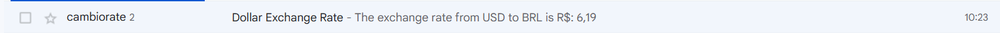

# Dollar Email Sender

## Overview

The Dollar Email Sender is a Spring Boot application that retrieves the current dollar exchange rate and sends it via email to a specified recipient. This project demonstrates the integration of Spring Boot with email services and reactive programming.

## Functionality



- Fetches the current dollar exchange rate using `DollarRateService`.
- Sends an email with the exchange rate details using `EmailService`.

## Technologies

- **Java 17**
- **Spring Boot 3.4.1**
- **Spring WebFlux**: For reactive programming.
- **Spring Boot Mail**: For sending emails.
- **Maven**: Build and dependency management tool.
- **Jakarta Mail**: For handling email functionalities.

## Good Practices

- **Dependency Injection**: Using Spring's `@Autowired` for injecting dependencies.
- **Configuration Management**: Externalizing configuration using `application.properties`.
- **Reactive Programming**: Using WebFlux for non-blocking operations.
- **Exception Handling**: Properly handling exceptions during email sending.

## Prerequisites

- Java 17 or higher installed.
- Maven.
- A Gmail account for sending emails.

## Setup

1. **Clone the repository**:
    ```sh
    git clone https://github.com/your-username/dollar-email-sender.git
    cd dollar-email-sender
    ```

2. **Configure Email Credentials**:
   Update the `src/main/resources/application.properties` file with your Gmail credentials:
    ```properties
    spring.mail.username=your-email@gmail.com
    spring.mail.password=your-email-password
    ```

3. **GET API Key**:
   Get an API key from [ExchangeRate-API](https://www.exchangerate-api.com/) and update the `DollarRateService` class with your API key.

```java
public Mono<DollarRate> getDolarRate() {
    String apiKey = System.getenv("EXCHANGE_RATE_API_KEY");
    String url = "https://v6.exchangerate-api.com/v6/" + apiKey + "/pair/USD/BRL";
}
```

4. **Build the project**:
    ```sh
    mvn clean install
    ```

5. **Run the application**:
    ```sh
    mvn spring-boot:run
    ```

## Usage

Once the application is running, it will automatically fetch the current dollar exchange rate and send an email to the specified recipient with the exchange rate details.

### Example

To see the logs and confirm the email was sent, check the console output for messages like:
```
INFO  [main] c.e.d.DollarEmailSenderApplication: The exchange rate from USD to BRL is R$: 5.25
INFO  [main] c.e.d.DollarEmailSenderApplication: Email sent successfully
```

## Conclusion

This project serves as a practical example of integrating Spring Boot with email services and demonstrates good practices in configuration management, dependency injection, and reactive programming.